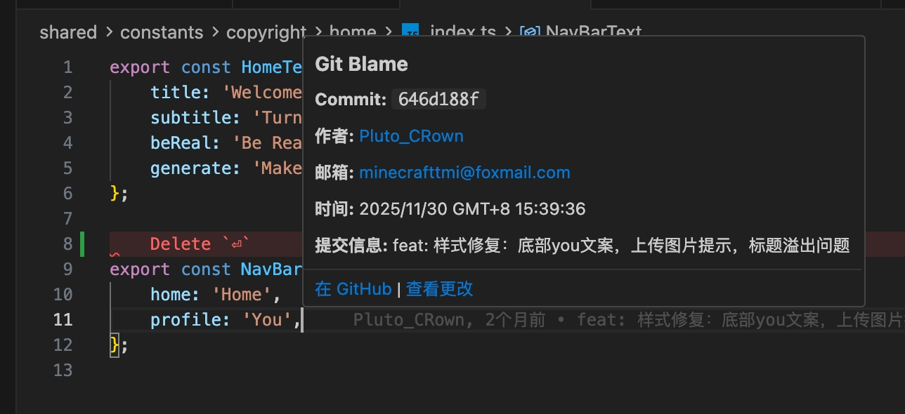
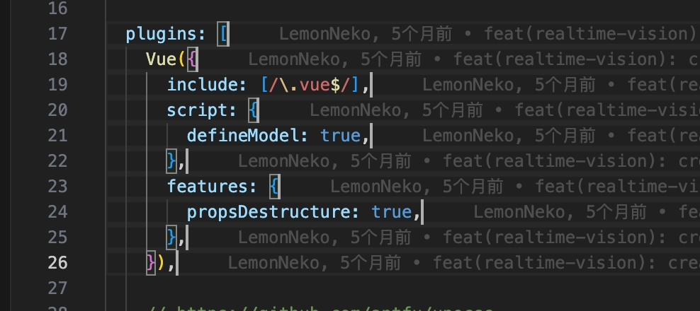
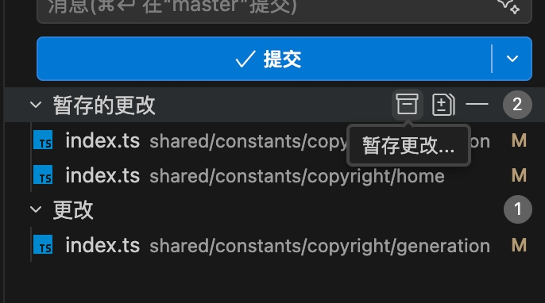

# Git Blame Inline

[English](./README.md) | **中文**

---

一个轻量级的 VSCode 插件，在每行代码末尾内联显示 Git Blame 信息，并提供丰富的悬停详情。

## ✨ 功能特性

- 🎯 **行内 Git Blame** - 在每行末尾显示作者、时间和提交信息
- 🔍 **丰富的悬停详情** - 查看完整的提交信息和可点击链接
- 🔗 **GitHub/GitLab 集成** - 快速访问远程仓库的提交和作者主页
- 📝 **查看提交更改** - 一键打开完整的提交差异对比
- 💾 **智能暂存** - 分别控制已暂存和未暂存更改的 stash 操作
- 🎨 **主题自适应** - 自动适配编辑器主题（深色/浅色）
- ⚡ **高性能** - 智能缓存，仅处理可见区域
- 🌐 **多语言** - 支持英文和简体中文
- ⚙️ **可自定义格式** - 配置 blame 信息的显示方式
- 📝 **多行提交信息** - 支持显示完整的多行提交消息

## 📸 功能展示

### 行内 Blame 显示
在每行末尾显示 Git blame 信息，包括作者、时间和提交消息。

### 多行提交信息支持
完整支持多行提交消息的显示和查看。

### 智能 Stash 功能
从源代码管理面板轻松暂存已暂存或未暂存的更改，并添加自定义消息。

**悬停查看详情：**
- 查看完整的提交信息
- 点击在 GitHub/GitLab 上查看提交
- 查看该提交的文件更改
- 直达作者主页的链接

## 🚀 快速开始

1. 从 VS Code 扩展市场安装插件
2. 打开 Git 仓库中的文件
3. Git blame 信息会自动显示在每行末尾
4. 将鼠标悬停在任意行上查看详细的提交信息

## 📋 命令

- **Git Blame 轻量版: 切换行内 Blame** - 切换行内 blame 标注的显示/隐藏
- **Git Blame 轻量版: 显示提交差异** - 查看特定提交的更改内容
- **暂存更改...** - 使用自定义消息暂存已暂存或未暂存的更改

## ⚙️ 配置选项

在 VS Code 设置中配置插件：

| 设置项                           | 类型    | 默认值                           | 说明                          |
| -------------------------------- | ------- | -------------------------------- | ----------------------------- |
| `gitBlameInline.enabled`         | boolean | `true`                           | 启用/禁用行内 blame 显示      |
| `gitBlameInline.format`          | string  | `"{author}, {time} • {message}"` | 自定义行内 blame 格式         |
| `gitBlameInline.messageLength`   | number  | `50`                             | 提交信息的最大显示长度        |
| `gitBlameInline.showStashButton` | boolean | `true`                           | 在源代码管理中显示 stash 按钮 |

### 格式变量

你可以在 `gitBlameInline.format` 中使用以下变量：
- `{author}` - 提交作者名称
- `{time}` - 相对时间（如 "2天前"）
- `{message}` - 提交信息
- `{hash}` - 短提交哈希

**示例格式：**
- `"{author}, {time} • {message}"` （默认）
- `"{author} ({time}): {message}"`
- `"{hash} - {author}: {message}"`

## 🔧 使用技巧

### Stash 功能
在源代码管理面板的"更改"或"已暂存的更改"上右键，可以找到 stash 按钮。你可以：
- 仅暂存已暂存的更改，保留工作树更改
- 仅暂存未暂存的更改，保留已暂存的更改
- 添加自定义消息来标识你的 stash

### 键盘快捷键
你可以为命令设置自定义快捷键：
1. 打开键盘快捷键设置（`Cmd+K Cmd+S` / `Ctrl+K Ctrl+S`）
2. 搜索 "Git Blame Lite" 或 "Git Blame 轻量版"
3. 分配你喜欢的快捷键

## ❓ 常见问题

### 为什么不用 GitLens？

虽然 GitLens 是一个强大的工具，但本插件提供了一个专注于行内 blame 显示的轻量级替代方案：

- **轻量高效** - GitLens 会占用大量内存（启动后可达 1.2GB 以上），而 Git Blame Lite 专注于最小化和高效运行
- **无商业化** - 本插件完全免费开源，没有任何商业/付费功能提示或付费墙
- **功能专注** - 提供核心的 blame 功能，无需复杂的完整 Git 工具套件
- **更好的性能** - 专门为行内 blame 显示优化，采用智能缓存和最小资源占用

如果您只需要 blame 信息并偏好轻量级解决方案，Git Blame Lite 是完美的选择。如果您需要全面的 Git 功能且不介意资源占用，GitLens 可能更适合您。

### 为什么不用 GitBlame、GitBlameInline 等其他插件？

市场上有其他 blame 插件，但 Git Blame Lite 提供了更好的体验：

- **GitBlame** - 信息显示不方便，不够直观，在编码时难以快速查看 blame 信息
- **GitBlameInline** - 只能显示一行信息，无法提供足够的上下文，远不如 GitLens 或 Git Blame Lite 好用
- **Git Blame Lite** - 集两者之长：方便的行内显示 + 丰富的悬停详情 + 多行提交信息支持 + 完整功能（查看差异、GitHub/GitLab 集成等）

Git Blame Lite 既轻量又功能丰富，提供了比基础 blame 插件更好的用户体验。

## 🤝 贡献

欢迎贡献！请随时提交问题和拉取请求。

查看[开发指南](./docs/DEVELOPMENT.zh-cn.md)了解开发说明。

## 📄 许可证

MIT License - 详见 [LICENSE](LICENSE) 文件。

## 🙏 致谢

灵感来自 GitLens 和其他 Git 工具，专注于轻量级的行内 blame 显示。
