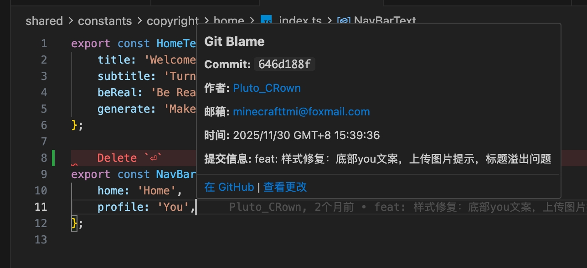
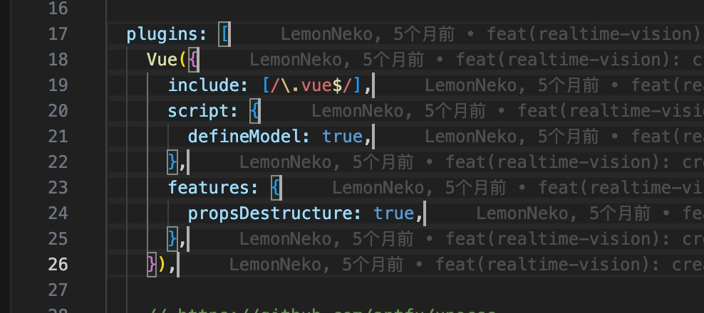
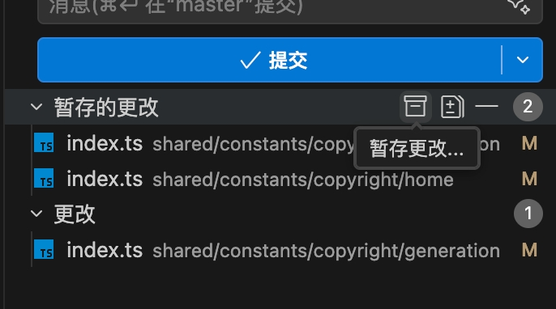

# Git Blame Inline

[English](./README.md) | **中文**

---

一个轻量级的 VSCode 插件，在每行代码末尾内联显示 Git Blame 信息，并提供丰富的悬停详情。

## 📸 功能展示

### 行内 Blame 显示
在每行末尾显示 Git blame 信息，包括作者、时间和提交消息。

### 多行提交信息支持
完整支持多行提交消息的显示和查看。

### 智能 Stash 功能
从源代码管理面板轻松暂存已暂存或未暂存的更改，并添加自定义消息。

**悬停查看详情：**
- 查看完整的提交信息
- 点击在 GitHub/GitLab 上查看提交
- 查看该提交的文件更改
- 直达作者主页的链接

## ❓ 常见问题

### 为什么不用 VSCode 内置的 Git Blame in Editor？

VSCode 现在已经内置了 Git Blame in Editor 功能，但它默认并不开启，而且阅读体验不够专注：

- **样式过亮** - 内置 blame 装饰在编辑器里过于显眼，容易干扰代码阅读
- **悬停面板太杂** - hover 面板里包含太多次要信息，想找到真正需要的提交详情反而更慢
- **更清爽的设计** - Git Blame Lite 保持行内样式克制，并让 hover 内容专注于有用的提交上下文

如果您希望 blame 信息清晰可读，又不打断编辑器里的代码阅读节奏，Git Blame Lite 会提供更好的体验。

### 为什么不用 GitLens？

虽然 GitLens 是一个强大的工具，但本插件提供了一个专注于行内 blame 显示的轻量级替代方案：

- **轻量高效** - GitLens 会占用大量内存（启动后可达 1.2GB 以上），而 Git Blame Lite 专注于最小化和高效运行
- **无商业化** - 本插件完全免费开源，没有任何商业/付费功能提示或付费墙
- **功能专注** - 提供核心的 blame 功能，无需复杂的完整 Git 工具套件
- **更好的性能** - 专门为行内 blame 显示优化，采用智能缓存和最小资源占用

如果您只需要 blame 信息并偏好轻量级解决方案，Git Blame Lite 是完美的选择。如果您需要全面的 Git 功能且不介意资源占用，GitLens 可能更适合您。

### 为什么不用 GitBlame、GitBlameInline 等其他插件？
- **GitBlame** - 信息显示不方便，不够直观，在编码时难以快速查看 blame 信息
- **GitBlameInline** - 只能显示一行信息，无法提供足够的上下文，远不如 GitLens 或 Git Blame Lite 好用

Git Blame Lite 既轻量又功能丰富，提供了比基础 blame 插件更好的用户体验。

## 🤝 贡献

欢迎贡献！请随时提交问题和拉取请求。

查看[开发指南](./docs/DEVELOPMENT.zh-cn.md)了解开发说明。

## 📄 许可证

MIT License - 详见 [LICENSE](LICENSE) 文件。

## 🙏 致谢

灵感来自 GitLens 和其他 Git 工具，专注于轻量级的行内 blame 显示。
